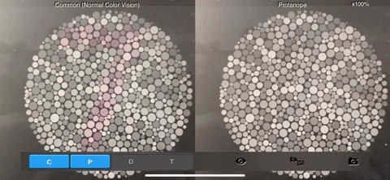

# OpFluorite
Colourblind Project

Goal: Modify a screenshot to filter out colours in a way that differentiates the colours better for protanopia.

MVP
1. Continuously check the screenshot folder for a new screenshot
2. Apply some colour changes onto the screenshot
3. Display the new image 
4. Be able to close the displayed image

Version 1.0 Result:

